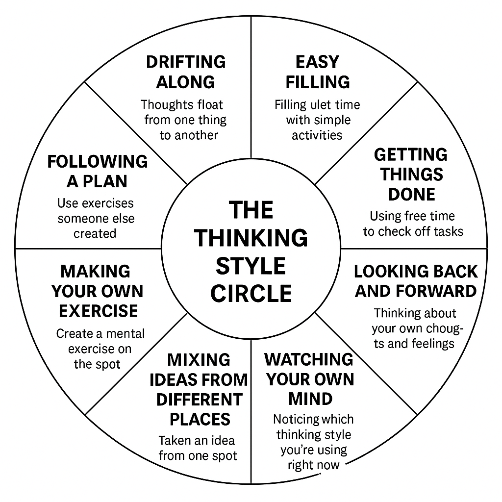

# Pilates of the Mind — Why Use It?

Do you ever feel stuck using the same thoughts over and over? Or wish you could handle tough moments better? 

Pilates of the Mind (PoTM) gives you simple mental exercises. Just like regular Pilates makes your body more flexible, these exercises make your thinking more flexible.

You'll learn to notice how your mind works right now, and then practice new ways of thinking that give you more choices.

It's not about "fixing" your thoughts. It's about having more tools to pick from.

---

## The Thinking Style Circle

These are different ways your mind naturally works. There's no "best" one — they're just different tools for different moments. Most people already use several of these without knowing it.

**Think of it like a circle of friends, not a ladder to climb.**

### Drifting Along
Your thoughts just float from one thing to another. (Like daydreaming or zoning out)

**Try this:** Notice the sounds around you for one minute. Don't judge them, just listen.

### Easy Filling  
You fill quiet time with simple activities. (Like checking your phone or small talk)

**Try this:** When you want to grab your phone, close your eyes for 30 seconds instead.

### Getting Things Done
You use free time to check off tasks. (Like answering emails while waiting in line)

**Try this:** While waiting somewhere, think of one new reason to feel grateful for what's coming next.

### Looking Back and Forward
You think about your own thoughts and feelings. (Like journaling or noticing your mood patterns)

**Try this:** At bedtime, write: "Today I noticed..." and "I wonder why..."

### Following a Plan
You use exercises someone else created. (Like meditation apps or breathing techniques)  

**Try this:** Pick any PoTM practice card and try it once.

### Making Your Own Exercise
You create a mental exercise on the spot. (Like asking yourself "How can I practice patience right now?")

**Try this:** Write down one small mental exercise idea that fits your day.

### Mixing Ideas from Different Places
You take an idea from one part of life and use it somewhere else. (Like using patience from fishing when your kid melts down, or using teamwork from sports when planning dinner)

**Try this:** Pick something you're good at. Use one idea from it in a completely different situation.

### Watching Your Own Mind
You notice which thinking style you're using right now. (Like catching yourself daydreaming or realizing you're problem-solving)

**Try this:** Once a week, write down which styles you used most. No judgment, just noticing.

---

## How PoTM Helps You

**Notice** – See what style you're using now  
*"I'm scrolling my phone again"*

**Shift** – Choose a different style on purpose  
*"Let me try that breathing exercise instead"*  

**Design** – Create your own small practices  
*"What if I made up a game for waiting in line?"*

---

## What a Practice Looks Like

Each PoTM practice fits on a single card and takes 1-5 minutes:

**The Move** – What you actually do  
**Use When** – The situation where it helps  
**Remember** – The main idea to keep in mind

### Example Card:

> **Listening to Hard News**
> 
> **The Move:** Listen fully to difficult news without defending or arguing  
> **Use When:** Someone tells you something hard to hear  
> **Remember:** A truth doesn't need your permission to be true. Just listen.

---

## How to Start (Takes 5 minutes)

1. **Find your usual style(s)** in the circle above. Which ones sound like you?

2. **Pick one different style** you'd like to try. Any one.

3. **Do that style's "Try This" exercise** once today.

4. **If you like it,** try it once a day for a week.

You don't need to go in order. Just keep exploring what works for you.

---

## Getting Your Practice Cards

The full set of ~75 practice cards covers all thinking styles. You can:
- Download them free at [website]
- Print your favorites to carry with you  
- Use the mobile app to get one card each day
- Create your own cards using the same format

---

## Common Questions

**What if I forget to practice?**  
That's normal. Just start again tomorrow. No pressure.

**How long should I try each style?**  
A week is good, but even one day teaches you something.

**Do I need to use all the styles?**  
Nope. Find 2-3 you like and get comfortable with those first.

**What if a practice feels weird?**  
That usually means it's different from your usual style. Try it 3 times before deciding if it fits you.

---

*Remember: You already know how to think. PoTM just gives you more ways to do it.*
